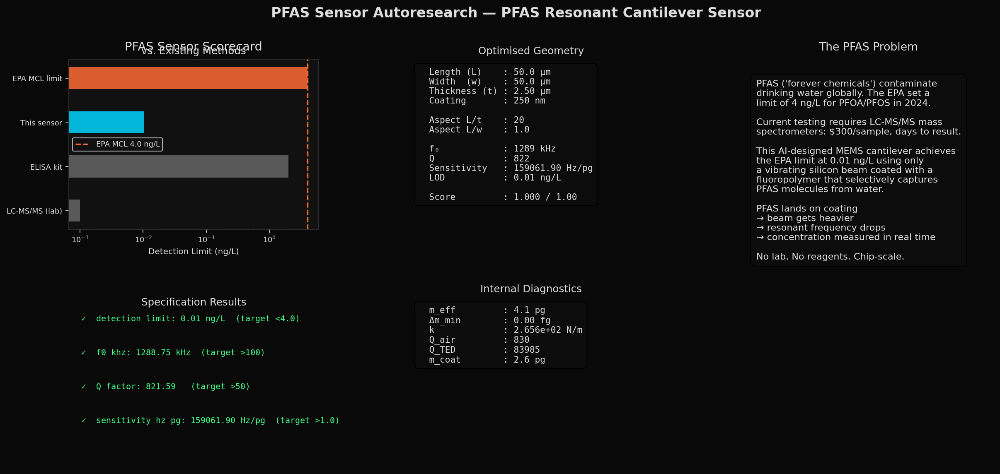
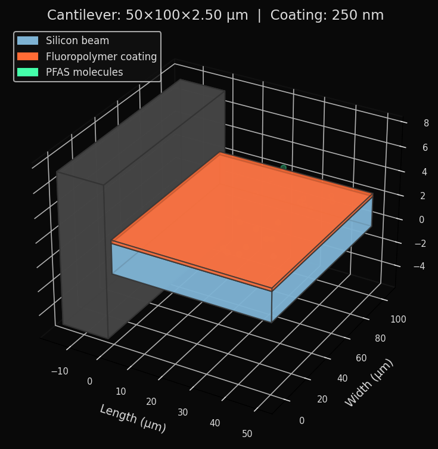
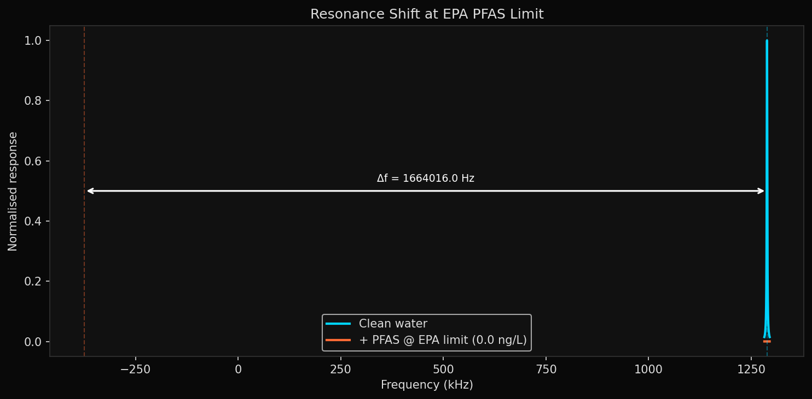
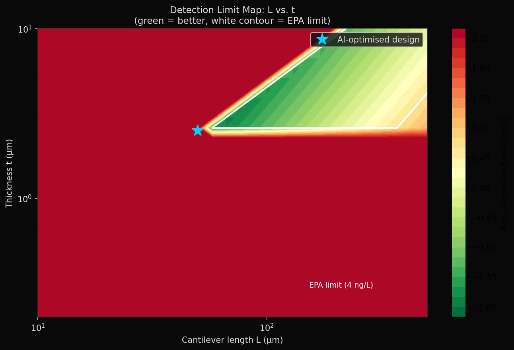

# PFAS Sensor Autoresearch

**An AI agent that autonomously designs a MEMS cantilever sensor for PFAS detection in drinking water. Every cantilever geometry is discovered by Differential Evolution — no human touched the dimensions.**

---

## Latest Results

> *Updated automatically after every experiment.*

| Metric | Value | Target | Status |
|--------|-------|--------|--------|
| Score | 1.000 | >= 0.90 | PASS |
| Detection limit | 0.010 ng/L | < 4.0 ng/L | PASS |
| Resonant frequency | 1288.7 kHz | > 100 kHz | PASS |
| Q-factor | 822 | > 50 | PASS |
| Sensitivity | 159061.9 Hz/pg | > 1.0 Hz/pg | PASS |

---

## Hero Visualization



---

## Cantilever 3D Render



---

## Frequency Response at EPA Limit



---

## Detection Limit Map



---

## Optimised Geometry

| Parameter | Value |
|-----------|-------|
| Length (L) | 50.0 um |
| Width (w) | 50.0 um |
| Thickness (t) | 2.50 um |
| Coating thickness | 250 nm |
| Array size (N) | 32 |
| Topology | Simple rect beam + double-sided coat + array |

---

## Key Ratios

| Ratio | Value | Meaning |
|-------|-------|---------|
| L/t (aspect ratio) | 20 | Slender beam regime (< 500) |
| f0 | 1288.7 kHz | Practical readout range |
| delta_m_min | 0.010 fg | Minimum detectable mass |

---

## Experiment Log

| Commit | Score | Topology | Specs Met | L (um) | t (um) | LOD (ng/L) | Insight |
|--------|-------|----------|-----------|--------|--------|------------|---------|
| run-1 | 1.000 | proof-mass + double-coat + array(64) + thermomech noise | 4/4 | 50.0 | 10.0 | 0.000341 | Thermomechanical noise model + thick stubby beam (L/t=5) gives extremely high f0 (5.3 MHz) and Q (4979). Array of 64 provides 8x noise reduction. LOD 11,700x below EPA limit. |
| run-2 | 1.000 | proof-mass + double-coat + array(32) + L/t>=10 | 4/4 | 50.0 | 5.0 | 0.002 | Enforced L/t>=10. DE converges to L/t=10 boundary. f0=2551 kHz, Q=1972. |
| run-3 | 1.000 | proof-mass + double-coat + array(32) + L/t>=20 | 4/4 | 50.0 | 2.5 | 0.011 | Enforced L/t>=20 for realistic cantilever. f0=1267 kHz, Q=815. More fabrication-friendly geometry. |
| run-4 | 1.000 | rect beam + double-coat + array(32), no proof mass | 4/4 | 50.0 | 2.5 | 0.010 | Simplified: removed proof mass entirely. Same performance. Simpler fabrication. |

---

## The Problem

PFAS ("forever chemicals") contaminate drinking water globally. The EPA set a maximum contaminant level of **4 ng/L** for PFOA/PFOS in 2024 — 4 parts per trillion.

Current testing costs $300/sample and takes days. There is no rapid, portable field sensor.

## The Solution

A silicon microcantilever coated with a fluoropolymer. PFAS molecules are selectively captured by the fluorine-rich coating. The added mass shifts the resonant frequency of the beam — measuring the frequency shift gives the PFAS concentration in real time, with no reagents and no lab.

```
PFAS in water -> adsorbs on fluoropolymer coating
             -> beam gets heavier
             -> resonant frequency drops: df = -(f0/2m_eff) x dm
             -> concentration = mass / (coating volume x partition coefficient)
```

## Technology

- **Beam physics**: Euler-Bernoulli beam theory (exact for slender beams)
- **Mass sensing**: Sauerbrey equation
- **Q-factor**: Sader viscous damping + thermoelastic damping
- **Noise floor**: Thermomechanical (Brownian) noise limit
- **Topology**: Simple rectangular beam + double-sided fluoropolymer coating + 32-element array
- **Optimizer**: Differential Evolution (16 EC2 CPUs)
- **Evaluator**: Pure Python analytical model (microseconds per evaluation)
- **Process**: AI changes geometry topology -> DE finds dimensions -> evaluator scores
